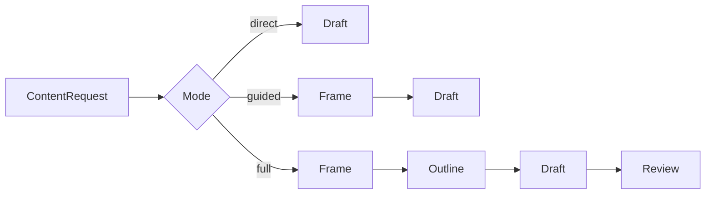

# Socrates

Build publishable content with rubrics, not vibes.

Socrates is a Python SDK and CLI for **strategy-first content generation**. Instead of asking a model to jump straight into prose, Socrates can build a frame first, then an outline, then a draft, then a lightweight review pass.

It is designed for AI builders, content systems, and product teams that need content to be:

- publishable
- audience-aware
- structurally sound
- opinionated without sounding generic
- reproducible in code and config

Project site: `https://miounet11.github.io/Socrates/`

## Why Socrates

Single-shot prompting tends to optimize for speed, not standards. That produces content that is readable but shallow, generic, and structurally interchangeable.

Socrates makes the standards explicit:

- `direct`: one-pass generation for simple transforms
- `guided`: frame + draft for normal publishable content
- `full`: frame + outline + draft + review for flagship work

## Quickstart

Install the CLI directly from GitHub:

```bash
uv tool install git+https://github.com/miounet11/Socrates.git
```

Or install locally from source:

```bash
git clone https://github.com/miounet11/Socrates.git
cd Socrates
uv sync --extra dev
```

Create config:

```bash
socrates init
```

Set credentials:

```bash
export OPENAI_API_KEY=your-key
```

Inspect the built-in presets:

```bash
socrates presets
```

Generate a starter request from a preset:

```bash
socrates template blog_post --output request.yaml
```

Generate a frame:

```bash
socrates frame request.yaml --json
```

Generate a draft:

```bash
socrates generate request.yaml --mode guided --format markdown
```

Run a review pass:

```bash
socrates review draft.md --request request.yaml
```

## 30-second Python example

```python
from socrates import ContentRequest, GenerationMode, Socrates

client = Socrates.from_config()

request = ContentRequest(
    topic="Why B2B onboarding content usually underperforms",
    audience="B2B SaaS product marketers",
    goal="Generate a publishable LinkedIn post with a clear point of view",
    platform="linkedin",
    content_type="linkedin_long_post",
    keywords=["onboarding", "activation", "messaging"],
)

result = client.generate(request, mode=GenerationMode.GUIDED)
print(result.draft.title)
print(result.draft.body)
```

## Public API

```python
from socrates import Socrates

client = Socrates.from_config()
frame = client.frame(request)
outline = client.outline(request, frame)
draft = client.draft(request, frame=frame, outline=outline)
review = client.review(request, draft, frame=frame)
result = client.generate(request, mode="full")
```

Key objects:

- `ContentRequest`
- `ContentFrame`
- `ContentOutline`
- `ContentDraft`
- `ReviewReport`
- `ContentResult`

## Example request format

```yaml
topic: "How to position AI copilots for operations leaders"
audience: "Operations leaders at mid-market SaaS companies"
goal: "Produce a publishable blog post draft"
platform: "blog"
content_type: "blog_post"
constraints:
  - "Avoid inflated claims"
  - "Keep examples concrete"
voice_notes:
  - "Confident but not hypey"
  - "Specific over abstract"
keywords:
  - "AI copilots"
  - "operations"
length_hint: "1200-1600 words"
include_cta: true
cta_goal: "Invite readers to request a demo"
```

## Routing model

Socrates auto-routes by `content_type`.

Direct:

- `summary`
- `rewrite`
- `translation`
- `hashtags`

Guided:

- `blog_post`
- `linkedin_long_post`
- `value_prop`

Full:

- `industry_analysis`
- `content_calendar`
- `brand_narrative`
- `flagship_article`

## Provider support

v0.1 ships one provider adapter: **OpenAI-compatible chat completions**.

Supported config fields:

- `provider.base_url`
- `provider.api_key`
- `models.default_model`
- `models.frame_model`
- `models.outline_model`
- `models.draft_model`
- `models.review_model`

Socrates prefers JSON-schema responses and falls back to prompt-for-JSON mode when needed.

## Architecture



More detail lives in [docs/index.md](docs/index.md) and [docs/architecture.md](docs/architecture.md).

## Built-in presets

Socrates now ships starter presets that encode common professional content workflows:

- `blog_post`
- `linkedin_long_post`
- `value_prop`
- `industry_analysis`
- `content_calendar`
- `brand_narrative`

These presets are available through:

```bash
socrates presets
socrates template brand_narrative --output request.yaml
```

## Comparisons

Socrates is not:

- a general agent framework
- a research crawler
- chain-of-thought tooling

Socrates is:

- a structured generation layer for publishable content
- a typed SDK that fits into product pipelines
- a CLI for reproducible YAML-driven jobs

## Development

```bash
uv sync --extra dev
uv run pytest
uv run ruff check .
uv run mypy src
uv build
```

## Roadmap

- Anthropic adapter
- custom preset loading from user config
- citation-aware review mode
- docs site and cookbook

## License

MIT
